This tutorial will provide you with information on how to set up your installation of VS Code to manage files of your servers with ease.

## A bit of info before we start

You will probably notice, based on the screenshots below, that this tutorial has been created on a Windows installation. That's correct, but you should be able to replicate the same procedure on other operating systems without much headaches.

This tutorial works on:

- **Windows**, **Linux** and **MacOS**, with some minor differences in file/folder picker and overall UI.
- [VSCodium](https://vscodium.com/) (A truly open VS Code experience, without the proprietary or AI integrations).

Tip: You can click on images to zoom in and out.

## Prerequisites

- Installation of [VS Code](https://code.visualstudio.com/).
- An up to date operating system.
- A few minutes of your spare time. :)

## Setup

1. Open VS Code and go to `Extensions`.

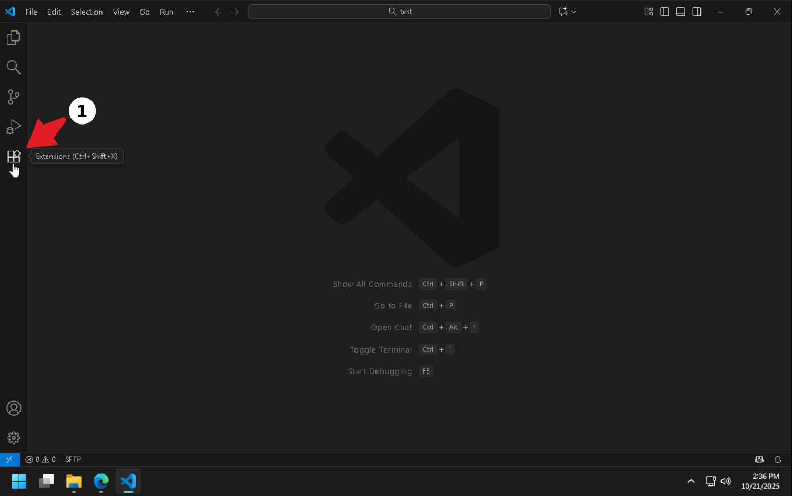

2. Search for `sftp`.

3. Install **SFTP** extension from **Natizyskunk** author (actively maintained and updated).

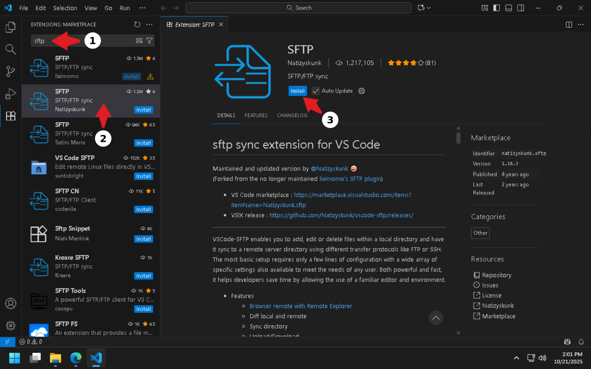

4. Click `Trust Publisher & Install`.

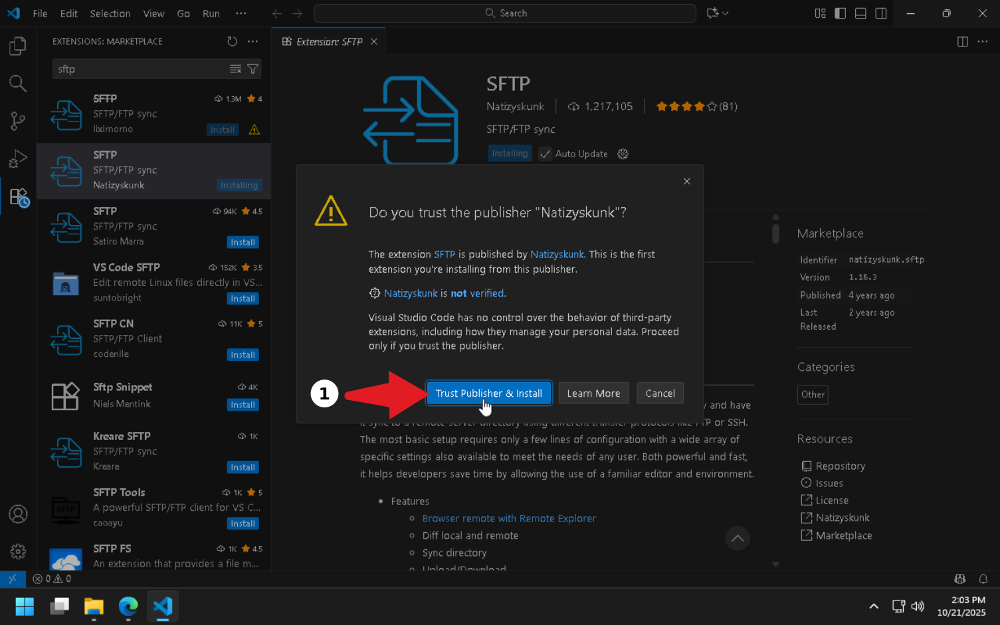

5. Press `Ctrl + Shift + P` or click `View > Command Palette...`, and type `sftp config`. Click on `SFTP: Config`.

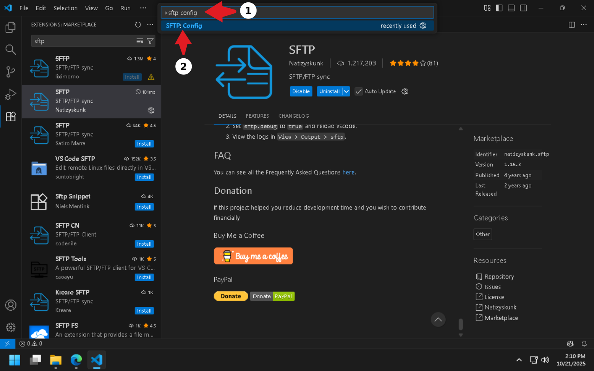

6. Click on `Open Folder` in notification area.

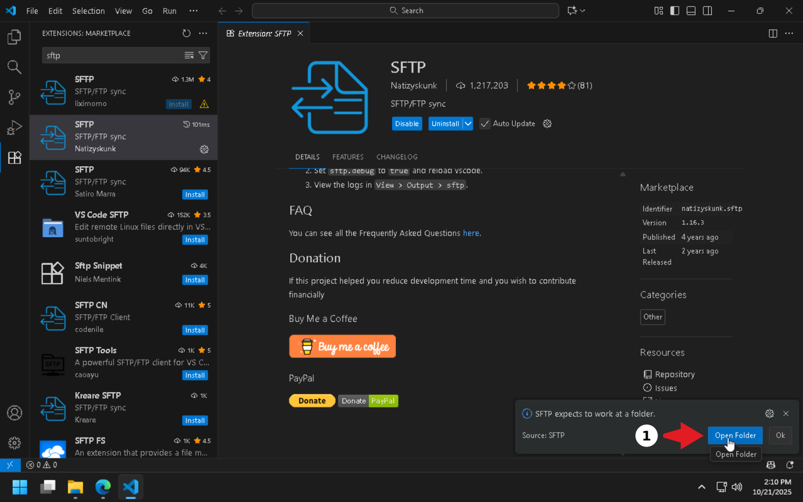

7. Create a new folder, name it however you want, make sure it's selected and click `Select Folder`.

<video width="700" controls>
    <source src="./assets/step7.mp4" type="video/mp4">
</video>

8. Click `Yes, I trust the authors` (it's your own empty folder, so it's safe).

9. Press `Ctrl + Shift + P` or click `View > Command Palette...`, and type `sftp config`. Click on `SFTP: Config` (same as step 5).

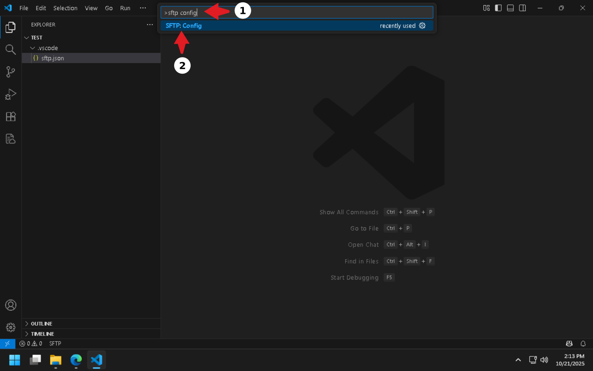

10. A file named `sftp.json` will be opened.

You will need to update 3 required fields in this file:

- `host` -> **files.peanuthost.net**
- `port` -> **42069**
- `username` -> see steps below on how to acquire your username

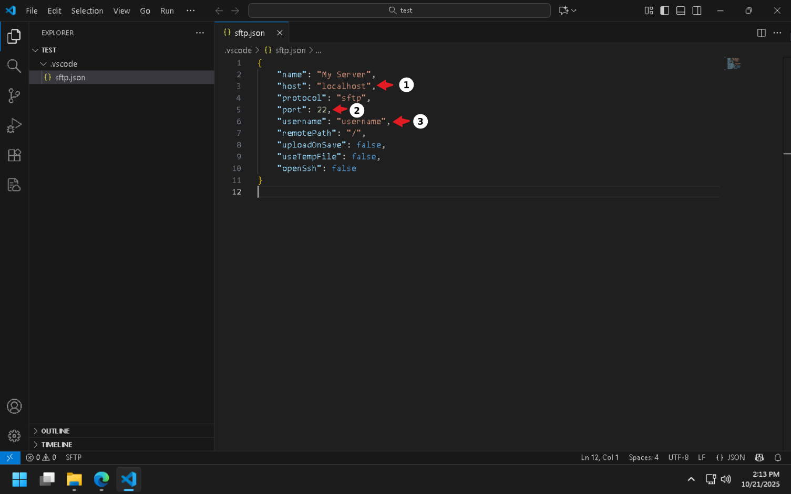

In order to get your username for your server (different for each server you own), you will need to follow the following steps:

- **Login** on PeanutHost panel with your account.
- Click on your server.

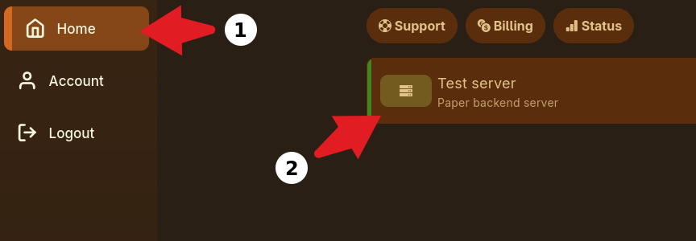

- Click on `Settings` and then on `SFTP Details > Username`. The username will then get copied to the clipboard. If that's not the case, just select + copy, like usually.

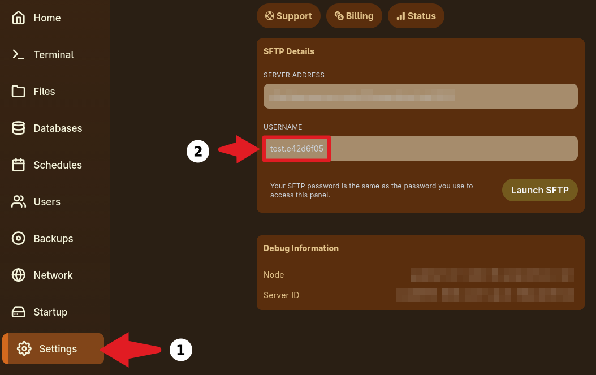

- Now you can update the `sftp.json` file in VS Code.

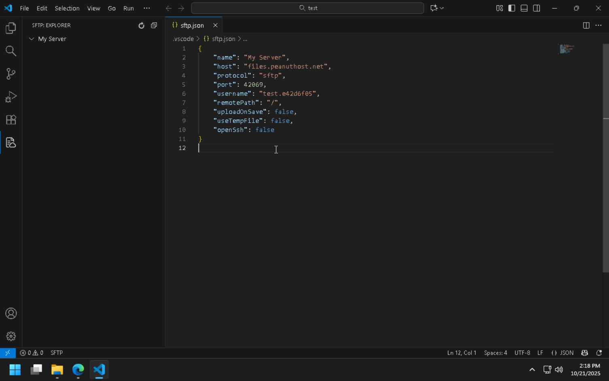

- Save the file.

11. Make sure you're on the `SFTP` module.

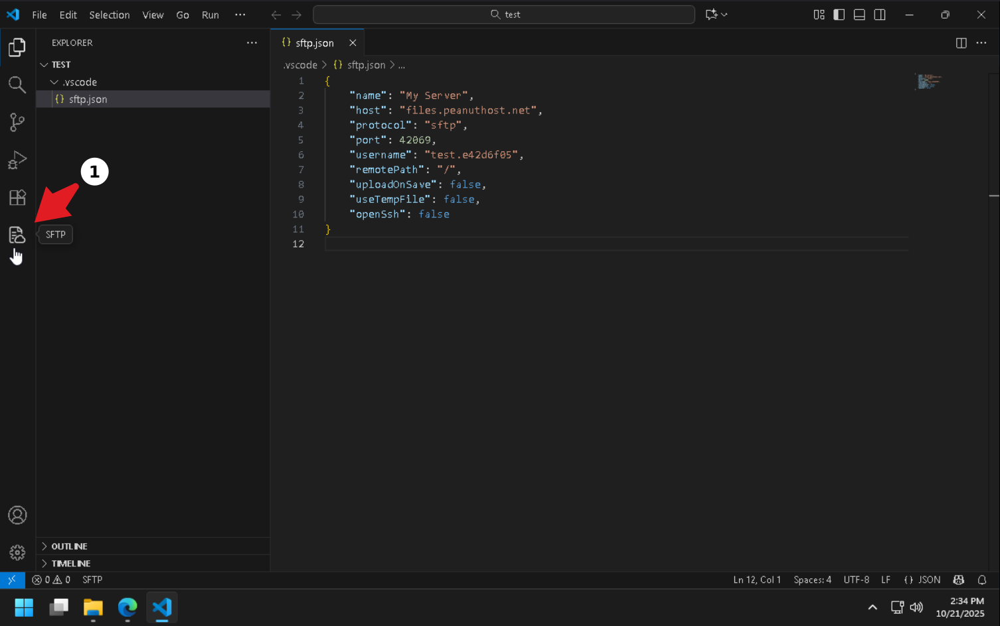

12. Click on `Refresh` button or on `My Server` in order to login.

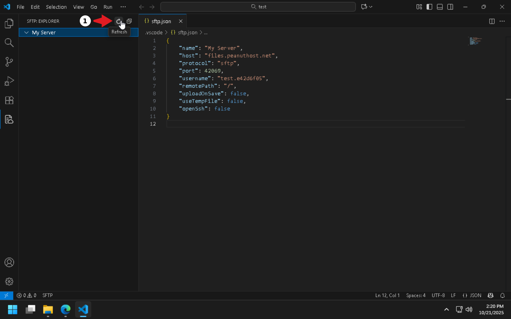

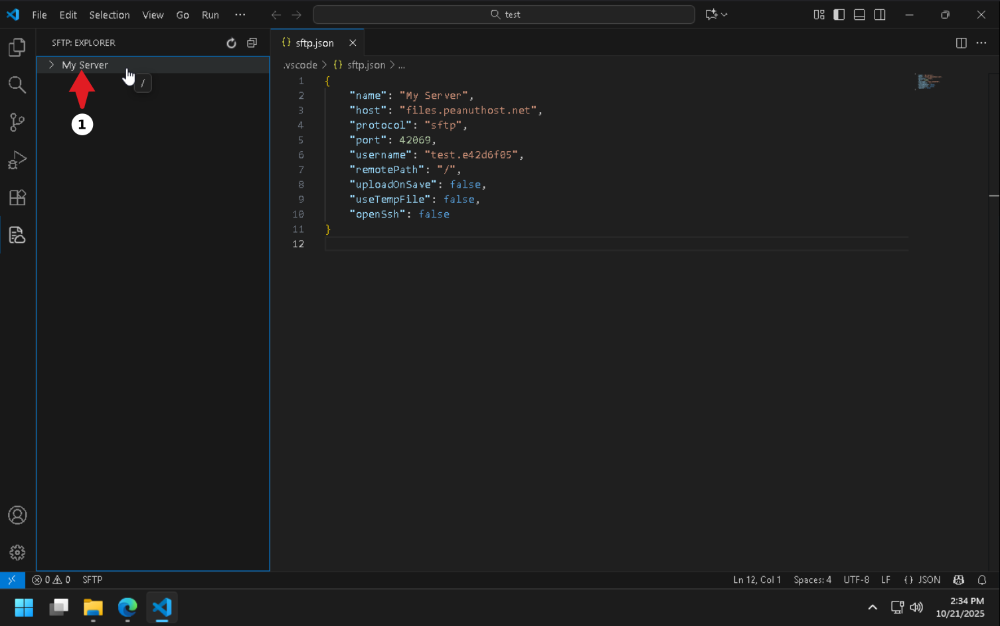

13. Type the password of your PeanutHost panel account and press `Enter`.

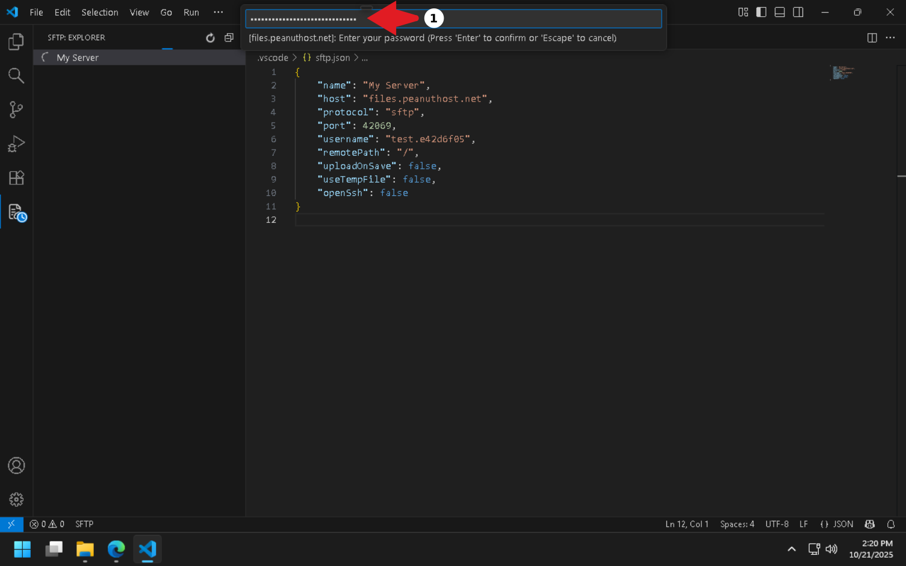

14. Congratsulations! You have successfully connected to your PeanutHost server files.

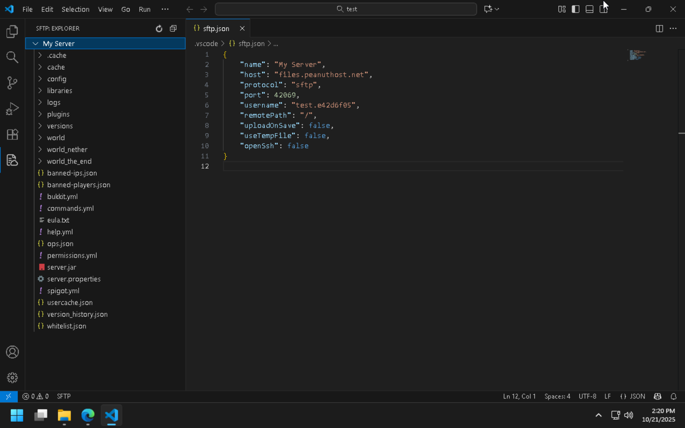

15. Now you can create, modify and delete files/folders, right from your VS Code installation. Enjoy! :)

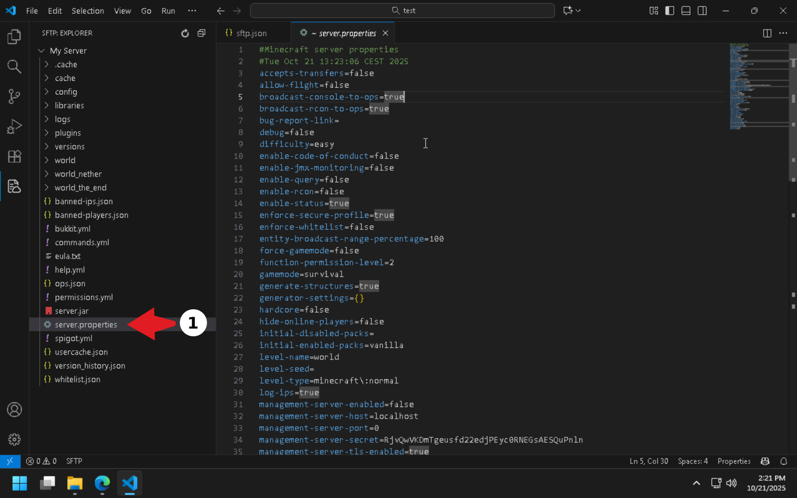

---

_Background image by [Boskampi](https://pixabay.com/users/boskampi-3788146/) from [Pixabay](https://pixabay.com/photos/programming-html-css-javascript-1873854/)._

_This article is licensed under the [Creative Commons Attribution 4.0 International (CC BY 4.0)](https://creativecommons.org/licenses/by/4.0/) license._
